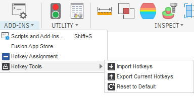
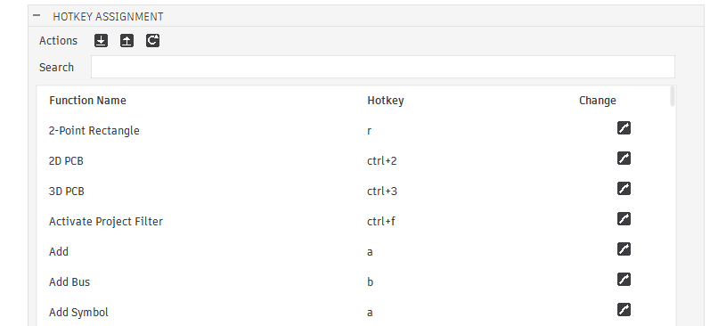
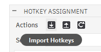
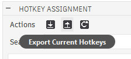
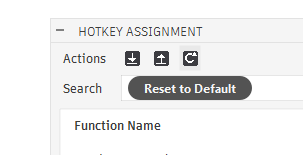

# Hotkey Assignment — Fusion 360 Add-In

A missing menu for Fusion 360: one window listing every command with a keyboard shortcut,
searchable, with a real Change button per row instead of digging through right-click menus one
command at a time.



Lives under **UTILITIES tab → ADD-INS → Hotkey Assignment** (Design workspace).

## What it does



- **Function Name / Hotkey / Change** table, built by reading Fusion's own live hotkey file.
- **Search** box filters the list live, by name or internal command ID.
- **Change** (pencil icon) opens Fusion's own native "assign new hotkey" popup for that command —
  key capture and conflict/override prompts are handled by Fusion itself.
- **Export Current Hotkeys** (↑) saves your full current hotkey set to a `.json` file you choose.
- **Import Hotkeys** (↓) loads a previously exported `.json` file — validated against Fusion's
  schema before anything is touched; a malformed file is rejected with the specific reason why.
- **Reset to Default** (↻) restores a saved baseline. See below for how that baseline is built.

| Import | Export | Reset to Default |
|---|---|---|
|  |  |  |

## Install

1. Download/clone this repo.
2. Copy the whole `HotkeyAssignment` folder (keeping `HotkeyAssignment.py`, `HotkeyAssignment.manifest`,
   and the `Resources` subfolder together) into your Fusion 360 Add-Ins folder:
   ```
   %APPDATA%\Autodesk\Autodesk Fusion 360\API\AddIns\
   ```
3. In Fusion: **UTILITIES → Add-Ins → Scripts and Add-Ins** (Shift+S) → **Add-Ins** tab → **+** →
   select the `HotkeyAssignment` folder → **Run**.
4. Tick **Run on Startup** if you want it to load automatically every session.

No third-party Python packages are required — only the standard library, already bundled with
Fusion's Python interpreter.

## How Reset to Default works

Autodesk doesn't publish a factory-default hotkey file anywhere that could be verified, so this
add-in won't fabricate one. Instead:

- The **first time** you click Reset to Default (and no baseline exists yet), it builds one
  automatically from bindings Fusion itself currently flags `isDefault: true` in your live
  hotkey file — i.e. keys you've never touched. Nothing changes yet; the baseline is just saved.
- Commands you'd *already* customised before that first click can't be recovered to their
  original key this way — Fusion's file doesn't retain what a binding used to be once it's moved.
  Those need fixing by hand, or by importing an old export/backup if you have one.
- Every click after the baseline exists restores it (with your current file backed up first).

## Safety notes

- Fusion has no public API to programmatically set a hotkey. The only reliable mechanism found
  is Fusion's own `HotKey.Dialog <command_id>` text command — used for Change, above.
- This add-in reads/writes Fusion's live hotkey file directly, at:
  `%LOCALAPPDATA%\Autodesk\Autodesk Fusion 360\<install-id>\hotkey.json`
  This is **undocumented and unsupported** — confirmed by testing, not by any Autodesk
  documentation. Autodesk could change its location or format in a future release.
- Every write to that file is preceded by an automatic timestamped backup
  (`hotkey_backup_<timestamp>.json`, same folder). Old backups are never deleted automatically.
- **Restart Fusion 360** after Import or Reset to Default to make sure the change fully applies.
- **Windows only.** The path above hasn't been tested or adapted for macOS.

## Limitations

- Only added to the Design workspace toolbar (`FusionSolidEnvironment`) — not Manufacture,
  Simulation, or Drawing.
- An unfiltered list is capped at 400 rows for performance — use Search to narrow it down.
- Function names fall back to the raw command ID when the owning workspace/extension (e.g.
  Simulation, Electronics) isn't currently loaded, since Fusion hasn't registered that command's
  display name yet.

## License

Not yet licensed — add one (MIT is a common choice for small Fusion add-ins) before treating
this as open source.
