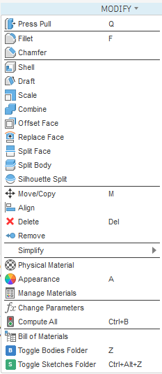

# Toggle Folder Visibility (Fusion 360 Add-In)

Toggles the **Bodies** folder and **Sketches** folder light bulb (visibility)
for the active component in Autodesk Fusion — the same action as clicking
the folder's own eyeball icon in the browser tree.

Unlike a blanket "hide all / show all", this only flips the *folder's* own
light bulb. Any bodies or sketches you've manually hidden or shown inside
that folder keep their individual state, exactly as if you'd clicked the
eyeball on the folder yourself.

## Features

- **Toggle Bodies Folder** — flips the Bodies folder light bulb for the
  active component.
- **Toggle Sketches Folder** — flips the Sketches folder light bulb for the
  active component.
- Individual body/sketch visibility is untouched — nothing is force-shown
  or force-hidden underneath the folder.
- Both commands can be given a keyboard shortcut via Fusion's standard
  shortcut UI (see below).

## Requirements

- Autodesk Fusion (desktop). Built and tested against the Fusion API as of
  Fusion 2026.8.
- No third-party Python libraries — only the built-in `adsk.core` /
  `adsk.fusion` modules Fusion provides.

## Installation

1. Download/clone this repository.
2. Copy the whole `ToggleFolderVisibility` folder (the `.py` file, the
   `.manifest` file, and the `resources` subfolder — keep them together)
   into your Fusion **AddIns** folder:

   | OS      | Path |
   |---------|------|
   | Windows | `%appdata%\Autodesk\Autodesk Fusion 360\API\AddIns` |
   | macOS   | `~/Library/Application Support/Autodesk/Autodesk Fusion 360/API/AddIns` |

3. In Fusion: **Utilities** tab → **Add-Ins** panel → **Scripts and
   Add-Ins** → **Add-Ins** tab → select **ToggleFolderVisibility** → **Run**.
   Tick **Run on Startup** if you want it to load automatically every time
   you open Fusion.
4. Two buttons appear on **Solid** tab → **Modify** panel:
   - **Toggle Bodies Folder**
   - **Toggle Sketches Folder**

## Assigning keyboard shortcuts

Fusion's API can't silently bind a global hot key — you assign one once,
via Fusion's own UI:

1. Hover over the button on the Modify panel (or find it in the panel's
   drop-down) until a **"..."** (three dots) appears in the corner.
2. Click it → **Change Keyboard Shortcut**.
3. Type your preferred key combination → **OK**.

You can also reach the same dialog from **Tools** tab → **Keyboard
Shortcuts**, then search by the command name.

**Shortcuts used in the screenshot above:** `z` for Toggle Bodies Folder,
`Ctrl+Alt+z` for Toggle Sketches Folder — neither is a default Fusion shortcut in
the Design workspace, so there's nothing to override. Pick any key you
like; these are just what's shown.

> Note: a command needs a valid icon before Fusion will show the "..."
> shortcut control on hover — this add-in ships icons in `resources/` for
> that reason, so no extra setup is needed.

## Uninstalling

**Utilities** tab → **Add-Ins** → **Scripts and Add-Ins** → **Add-Ins**
tab → select **ToggleFolderVisibility** → **Stop**, then delete the
`ToggleFolderVisibility` folder from the AddIns directory above.

## License

MIT — see `LICENSE`.
